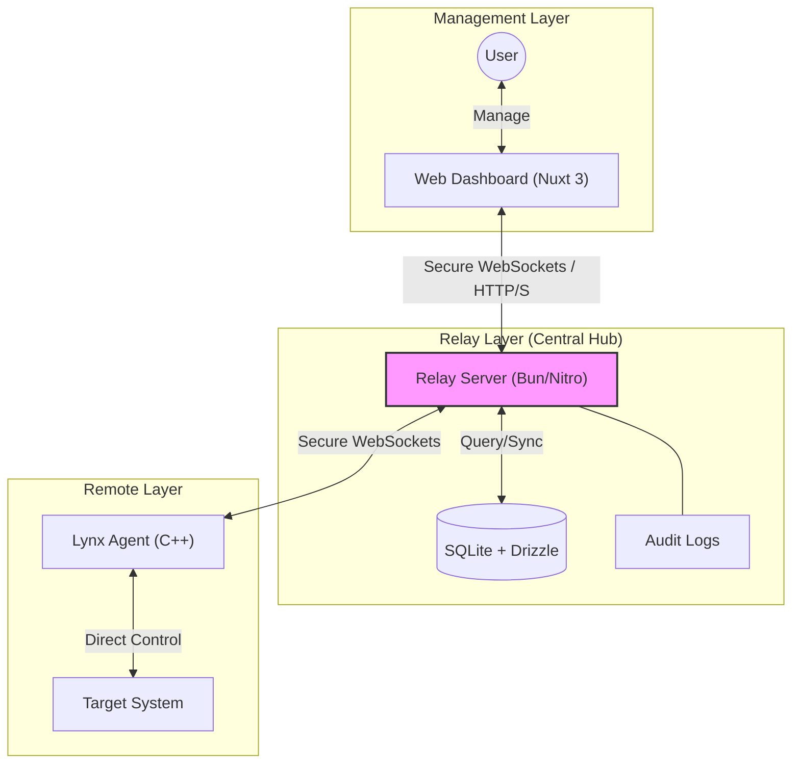

# Lynx App - Remote Agent Device Controller
Lynx App is a lightweight and powerful remote agent device controller that allows you to remotely control, monitor, and manage multiple devices from a centralized dashboard.
It is designed for developers, sysadmins, and power users who need real-time remote terminal access, device monitoring, and remote command execution in a simple and efficient way.

## Features
- **Remote Terminal Access**: Securely access and control remote devices via terminal.
- **Device Monitoring**: Monitor device status, resource usage, and performance metrics in real-time
- **Remote Command Execution**: Execute commands on remote devices with ease.
- **Multi-Device Management**: Manage multiple devices from a single dashboard.

## Available on
- Windows
- macOS (not yet)
- Linux (not yet)

## How it works?

Lynx operates through a central relay architecture that ensures secure and low-latency communication between the dashboard and remote agents.

### Flow Breakdown
1.  **Connection**: The **Lynx Agent** connects to the **Relay Server** via a persistent, secure WebSocket.
2.  **Relay**: The **Server** acts as a central hub, routing user commands from the **Dashboard** to the specific **Agent**.
3.  **Action**: The Agent executes commands locally (Terminal, Filesystem, Process management) and streams results/media back.
4.  **Monitoring**: Real-time metrics (CPU, RAM, Disk) are collected by the Agent and pushed to the Server for storage and visualization.
5.  **Security**: Every action is intercepted by the Relay Server, authenticated, and logged to the Audit system.

## Components
- **Lynx Server**: The backend server that handles device connections, command execution, and data management.
- **Lynx Client**: The frontend application that provides the user interface for managing and controlling devices.
- **Lynx Agent**: The lightweight agent installed on remote devices to facilitate communication with the Lynx Server.

## Instalation
> Coming soon!

## Roadmap
- [ ] Initial Release
- [ ] Cross-Platform Support (macOS, Linux)
- [ ] Enhanced Security Features
- [ ] Advanced Monitoring and Analytics
- ...? Have any ideas? Open an issue or PR!

## License
Lynx App is licensed under the MIT License. See the [LICENSE](LICENSE) file for more information.

## Contributing
Contributions are welcome! Please fork the repository and submit a pull request with your changes.
For major changes, please open an issue first to discuss what you would like to change.